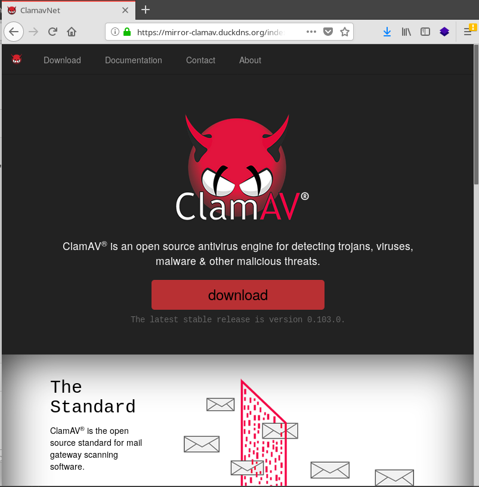
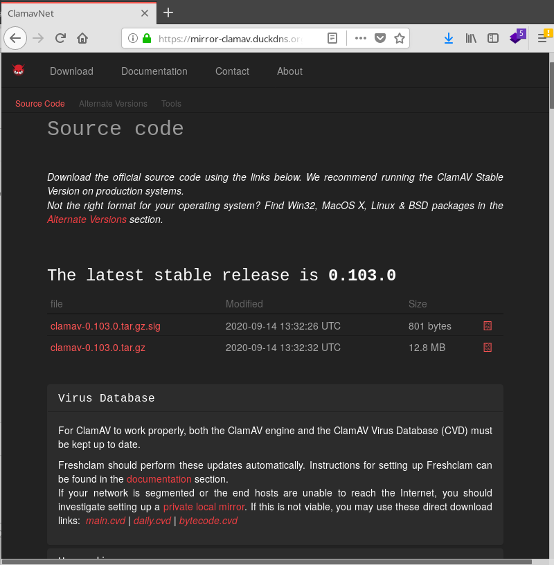

## Micro service Mirror ClamAV Virus Database (CVD) 

Aporte de Argenis Ochoa Gonzalez (@linux8a)


*  
[Mirror local clamav Database descargando desde sitio oficial  ](./mirror_clamav)

Uso

```
docker-compose up -d
```

* 

[Mirror local clamav Database descargando desde un mirror  ](./mirror_clamav_for_Cuba)

Uso

```
docker-compose up -d
```

* Capturas






* Configuracion freshclam

```
###############
# General
###############

DatabaseDirectory /store
LogSyslog yes
LogTime yes
PidFile /run/clamav/freshclam.pid
DatabaseOwner root

###############
# Updates
###############

#DatabaseMirror 
PrivateMirror https://tu ip 0 tu url/
DatabaseCustomURL https://tu ip 0 tu url/database/main.cvd
DatabaseCustomURL https://tu ip 0 tu url/database/daily.cvd
DatabaseCustomURL https://tu ip 0 tu url/database/bytecode.cvd
DatabaseCustomURL https://tu ip 0 tu url/database/safebrowsing.cvd
ScriptedUpdates yes
NotifyClamd /etc/clamav/clamd.conf
SafeBrowsing yes
Bytecode yes
```

* Donacion:


