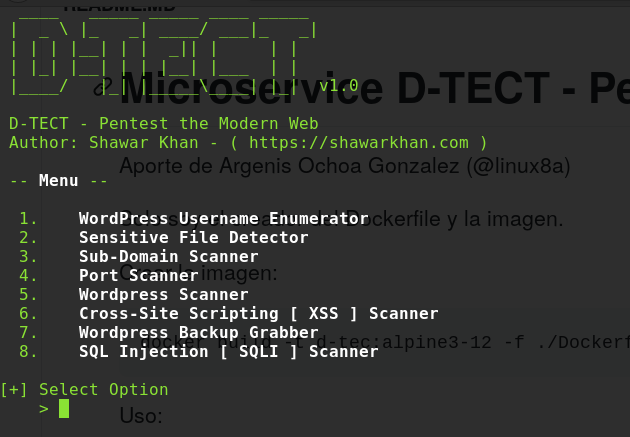

# Microservice D-TECT - Pentest the Modern Web

Aporte de Argenis Ochoa Gonzalez (@linux8a)

Solo soy el creador del Dockerfile y la imagen.

Crear la imagen:

```
docker build -t d-tec:alpine3-12 -f ./Dockerfile.
```

Uso:

```
docker run -it --rm d-tec:alpine3-12
```



Website:
https://github.com/linux8a/D-TECT-1/

* Donacion:


o un usd en bitcoin


