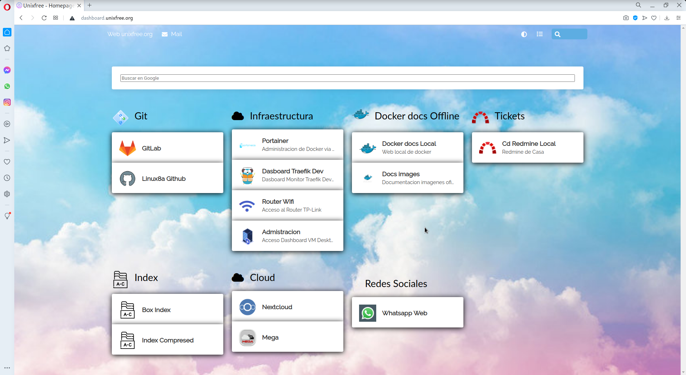
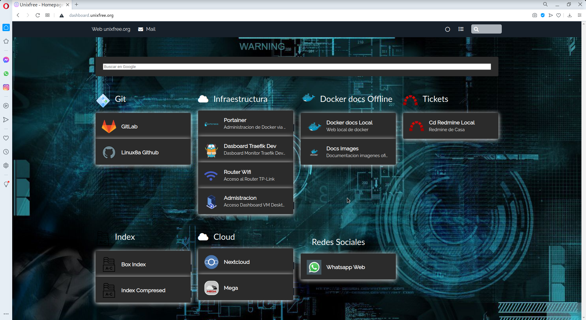

# Microservicio HomePage
Aporte de Argenis Ochoa Gonzalez (@linux8a)

Esta imagen esta creada para disponer de manera facil un hompage con los accesos directos a las web que deseas usar. De esta manera tendras un pagina atractiva y vistoza  que centraliza tus recursos de una manera ordenada.  

## Manera de implementarlo

Puedes usar cualquiera de las dos opciones.

1. Implementandolo en la imagen oficial de nginx

[Nginx ](Homepage_nginx)

```sh
cd Homepage_nginx
sudo chmod +x Run.sh
./Run.sh
```

* Explicacion de lo que hace el script `Run.sh` . El se encarga de descargar zip con la aplicacion, descomprimirla y luego levantar la imagen oficial de nginx y usar la carpeta descomprimida como volumen para que el nginx nos de la pagina homepage.

1. Usando la imagen oficial de los creadores de esta pagina estatica.

[Homer](Homepage)

```sh
cd Homepage
docker-comose up -d
```


## Como personalizar la pagina homepag

Entre a la carpeta assets y edite el archivo `config.yml` el es el encargado de declarar y hacer publico nuestros vinculos. Estas son las secciones mas importantes:

Bajo la seccion services es donde declaramos el servicio a mostrar en su card:

```yml
- name: "Git"
    logo: "/assets/icons/Git_blue.png"
    items:
      - name: "GitLab"
        logo: "/assets/icons/gitlab.png"
        url: "#"
        target: "_blank"
        tag: "Git Repos"
```

## Es posible implementarlo fuera de docker?

Si. Puedes implementar este homepage en cualquier servidor. Sea nginx, apache, python, lighttpd etc. Solo necesitas apuntar en el config a la carpeta descomprimida descargada del github.


### Capturas de panatalla

* Tema Light 



* Tema Dark



Disfrute de su nuevo Homepage

* Donacion:


o un usd en bitcoin


