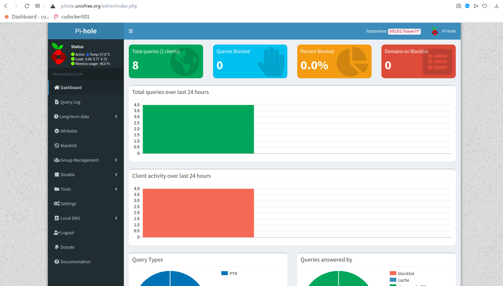

# ## Micro service Pi-hole

Aporte de Argenis Ochoa Gonzalez (@linux8a) 


## Uso

```
docker-compose up -d
```



* Github Oficial: https://github.com/pi-hole/docker-pi-hole/

* Donacion:


o un usd en bitcoin


