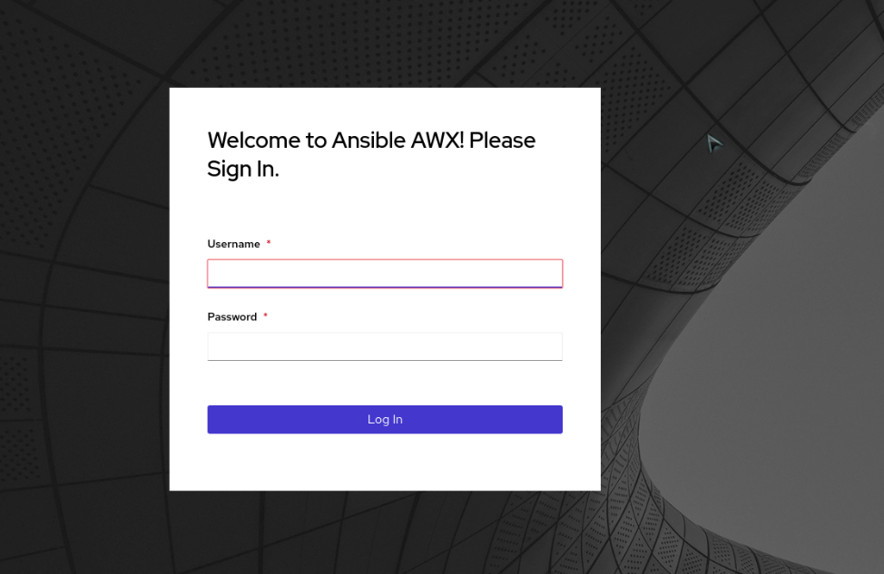
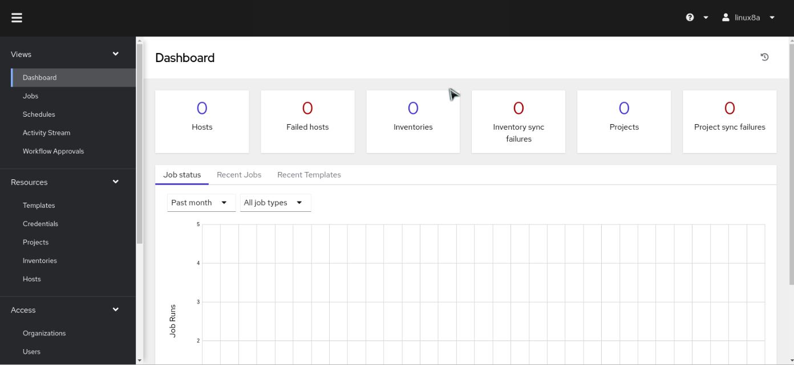

# Microservice AWX

* AWX

AWX es una interfaz web para poder administrar nuestros roles que hemos creado en Ansible. Como ya es habitual, RedHat nos tiene acostumbrados a tener dos vertientes del mismo producto: uno comercial y el otro gratuito. AWX es su producto OpenSource y su correspondiente producto comercial es Ansible Tower.

* El secret que desees usar

```
echo "awk" > etc/SECRET_KEY
```
* Copiar envexamples

```
cp envexamples .env
```

* Ejecutamos nuestro  Microservice

```
docker-compose up -d
```

* Setear permisos redis

```
chmod 777 data/redis_socket -Rv
```

Execute command 
```
docker-compose exec web awx-manage migrate --noinput
```

Set admin user

```
docker-compose exec web awx-manage createsuperuser --username admin
```

Felicidades ya tenemos nuestra ansible AWX 

#Screenshot






Referencia:
git clone https://github.com/ansible/awx.git
git clone https://github.com/ansible/awx-logos.git

* Donacion


