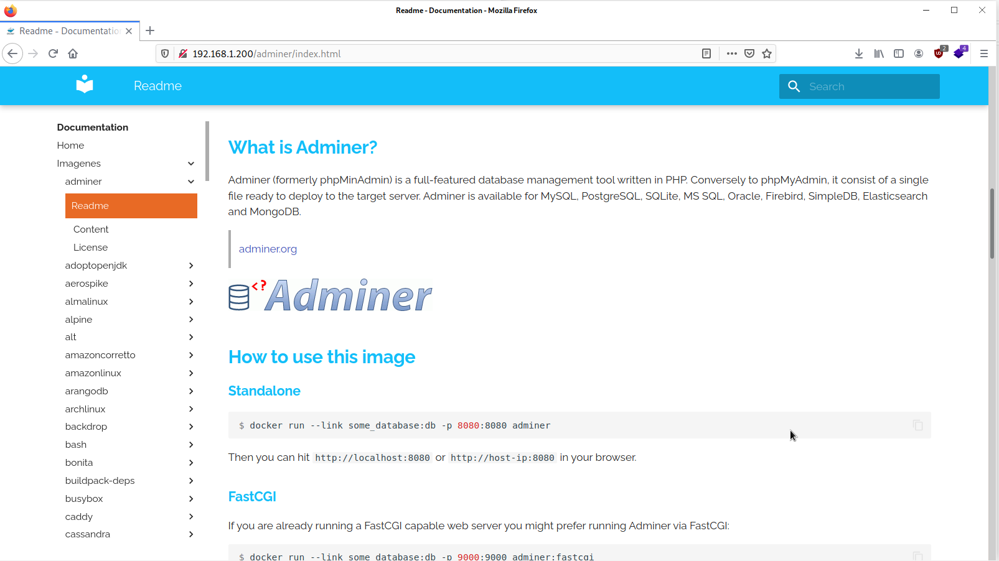
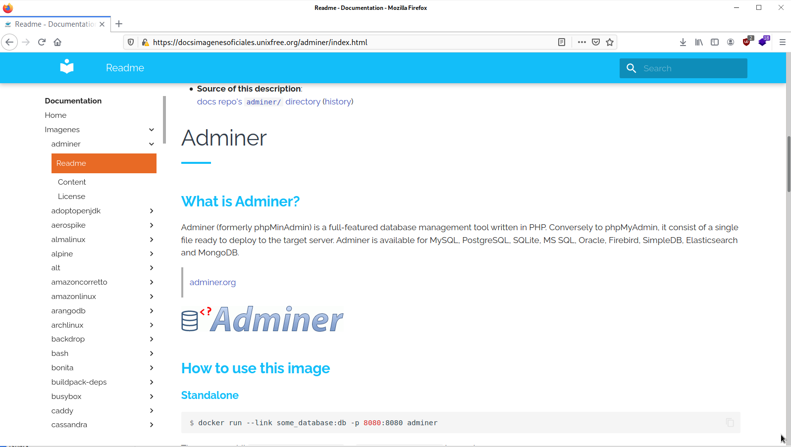
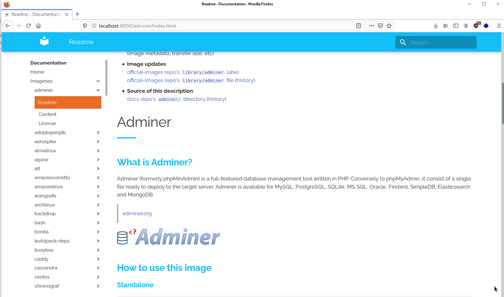

# Microservicio docsimagesdocker

Aporte de Argenis Ochoa Gonzalez (@linux8a)

## Descripcion

Esta microimagen esta hecha para tener la ayuda completa de las imagenes oficiales de Docker desconectado; sus opciones, tag etc. Esta pensada para usar por los de la comunidad docker de cuba. Pues para acceder https://hub.docker.com/ es necesario usar vpn. Aca usamos el github official de ayuda de las imagenes y la empaquetamos con mkdocs.

## Tags

<details>
<summary> v2 </summary>
Cambios

Comienza el proyecto. 
</details>

<details>
<summary> v2.0.1 </summary>
Cambios

Se agrego la documentacion de las siguientes imagenes:
* gitlab
* gogs 
* gitea 
* Roundcube 
* Zabbix  
</details>


## Uso


```
docker-compose -f docker-compose_ngnix.yml up -d
```

**Captura**




* Usarlo declarando labels de traefik como proxy reverso

```
docker-compose -f docker-compose_traefikv2.yml up -d
```

**Captura**



* Develop

```
docker-compose -f docker-compose_dev.yml
```

**Captura**


* Uso desde docker cli

```
docker run -d -p 8000:8000 linux8a/docsimagesdocker:v2
```

* Donacion:


o un usd en bitcoin


