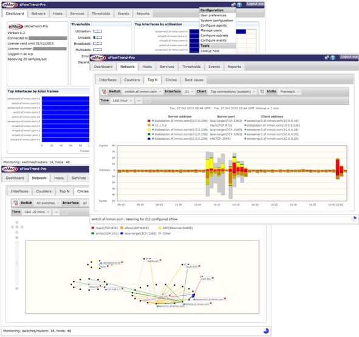

# Microservise inmon 

docker-compose create by Argenis Ochoa Gonzalez (@linux8a)

Suggested service to  by Yoslan (@yoslan)

1. This now execute

docker-compose up -d

2. Find serial key or use version free

## Introducing sFlowTrend-Pro (inMon)

* sFlowTrend

sFlowTrend™ is a free, graphical network and server monitoring tool. sFlowTrend makes use of the popular sFlow® standard to generate real-time displays of the top users and applications making use of network bandwidth. sFlowTrend also uses the extensions to the sFlow standard for monitoring physical and virtual server performance, to link network, server, and application performance and provide an end-end view of networked system performance. sFlowTrend accepts sFlow data from at most five switches or hosts and stores one hour of data in memory. sFlowTrend-Pro does not limit the number of switches or hosts that can be monitored and stores historical data to disk. 

sFlowTrend-Pro is a Java application, which monitors sFlow® enabled network switches, routers and hosts. It is designed to be easy to install and use, and to allow network and host problems to be understood and resolved quickly. Summaries and detail of network traffic can be displayed for the whole network, on a per-switch or per-interface level, thresholds used to provide alerts to abnormal traffic conditions, and historical traffic patterns reviewed to determine when changes occurred. Host performance metrics can be monitored for an entire data centre.

Reference: https://inmon.com/

* Donacion:

