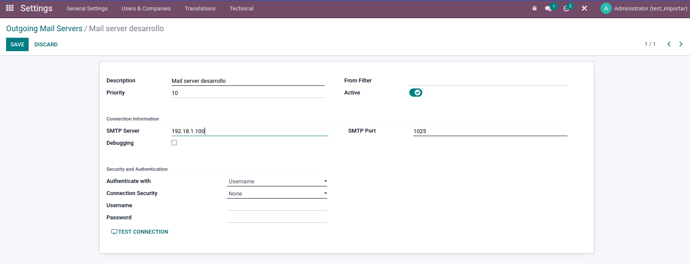
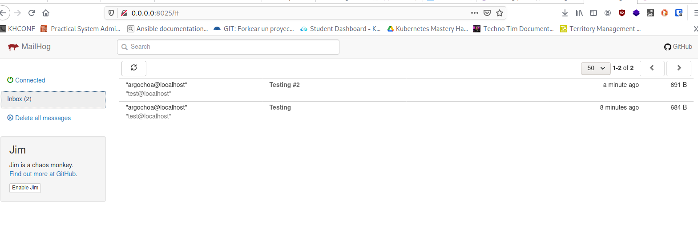

## Stack de mailhog

Aporte de Argenis Ochoa Gonzalez (@linux8a)

## Que es Mailhog

MailHog es una herramienta de pruebas de correo electrónico de código abierto dirigida principalmente a los desarrolladores. Te permite probar las capacidades de envío y recepción de correos electrónicos de tu aplicación web de forma más eficiente.

Ver planes

Construido con el lenguaje de programación Go, MailHog puede ejecutarse en múltiples sistemas operativos, incluyendo Windows, Linux, FreeBSD y macOS. MailHog es mantenido por Ian Kent y fue lanzado bajo la licencia MIT, por lo que puedes desplegarlo libremente para usos personales y comerciales.

En primer lugar, ¿por qué necesitas MailHog?

## Por Qué Necesitas MailHog

MailHog resuelve muchos de los principales problemas de los tests de correo electrónico.

Digamos que estás desarrollando un sitio web de WordPress en un entorno de desarrollo local. Si quieres probar un formulario de contacto o cualquier otro correo electrónico saliente desde él, puede ser una tarea desesperante.

Normalmente, el servidor SMTP por defecto de la aplicación web se encarga de esta tarea. En un entorno de desarrollo local, casi nunca funciona debido a múltiples razones.

Puedes leer nuestra extensa guía sobre servidores SMTP gratuitos para saber más sobre cómo funciona un servidor SMTP.

## MailHog en Docker

Docker es una de las formas más fáciles de configurar MailHog en cualquier plataforma.

En primer lugar, asegúrate de que tienes Docker instalado en tu máquina. A continuación, puedes iniciar MailHog directamente desde Docker Hub ejecutando el siguiente comando:

```docker run -d -p 1025:1025 -p 8025:8025 mailhog/mailhog```

o puedes usar para desplegar el stack docker-compose

```docker-compose up -d```

## Ejemplo

Vamos a un ejemplo en la practica. Conectaremos nuestro desarrollo de odoo al server MailHog. Vamos como desarrollador a tecnichal/Outgoing Mail Servers
 y configuramos los siguientes valores:

Description:  La descripción que ud desee.
SMTP Server:  Aca ponemos la ip donde tenemos expuestos nuestro servidorcito MailHog.
SMTP Port: 1025




Listo a probar y disfrutar de nuestros correos.
Para ver los correos use el UI web accediendo a http://tuip:8025



**Nota:** *También puedes probar el servidorcito directamente con el comando* `sendEmail` *de esta forma* `sendEmail -f correo@localhost -t test@localhost -u "Testing" -m "Test ok" -s 192.168.1.100:1025 ` *sustituye la ip por donde lo tengas expuesto*


* Donacion:


o un usd en bitcoin

