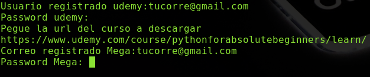
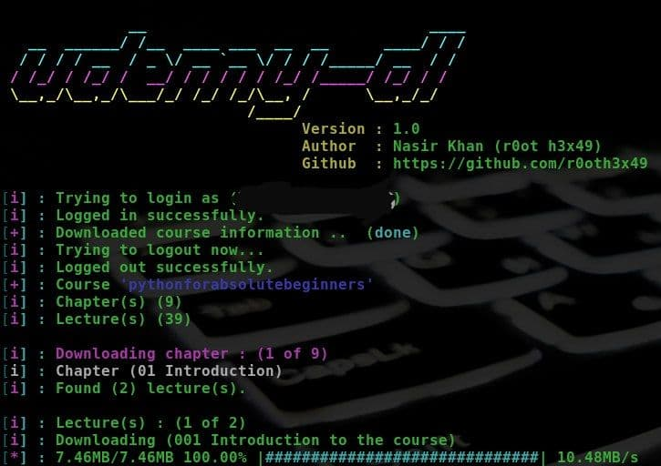
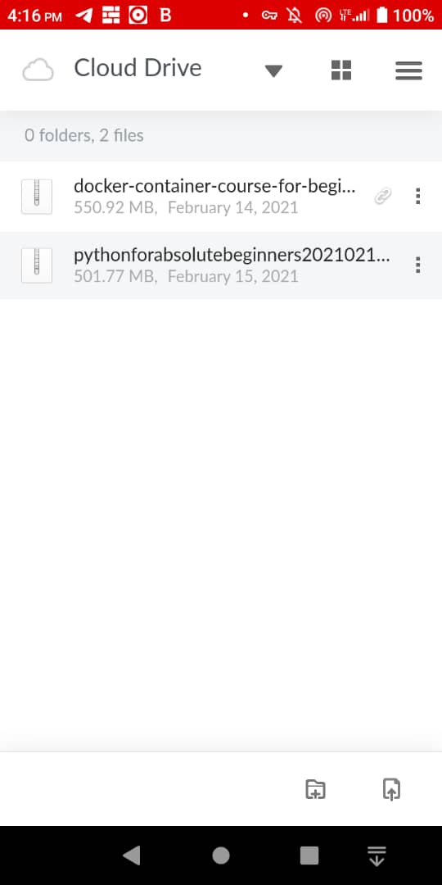

# Microservicio megaudemy-dl
Para descargar Cursos de Udemy y subirlo a Mega

Aporte de Argenis Ochoa Gonzalez (@linux8a)

Testeado por レイニエル (@k4rm0nk3y) y sugerencia de dividir el archivo comprimido por volumenes. Para facilitar la descarga en conexiones
mas lentas.

* [Version para el que tenga un buen ancho de banda](./megademy-dl:v1)


* [Version para el que tenga ancho de banda bajo](./megademy-dl:v2)

## Pasos para usarlo

1- Clonar el recurso

```
git clone  https://github.com/linux8a/megaudemy-dl.git
```

2- Entrar al git descargado megaudemy-dl.git y escoger la version que dese usar.

```
cd megaudemy-dl.git
```

3- Crear la imagen desde el script

```
./build.sh
```

4. Ejecutar el script run  le pedira el usuario registrado en udemy (use el correo)

```
./run.sh
```
* Capturas






